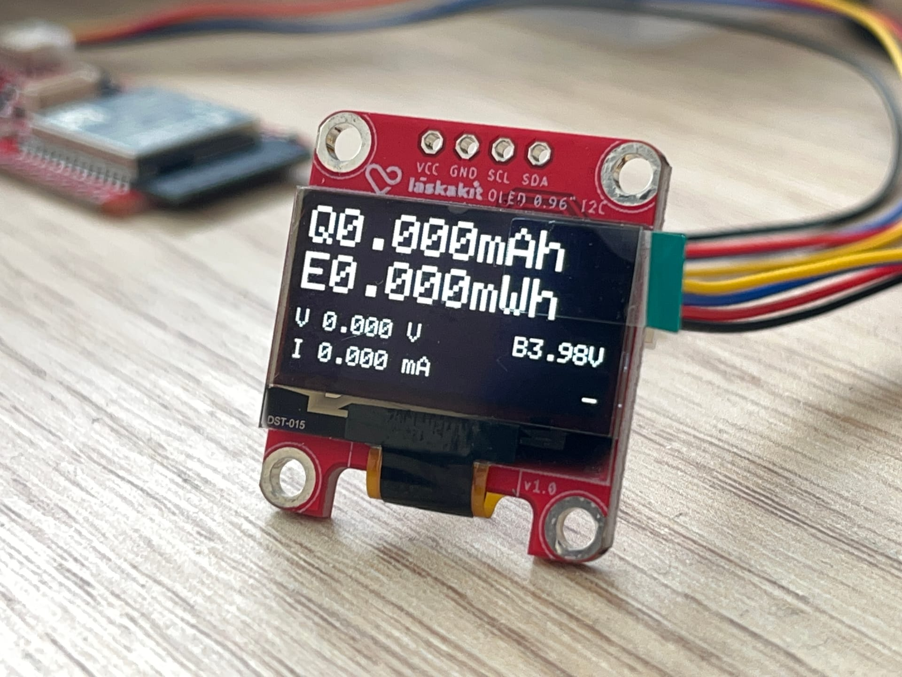

# Coul-o-meter

This is a simple ESP32-S3-based coulomb / watthour meter project built from prefabricated LaskaKit modules:

- ESP32-S3 development board
- INA226 power meter module
- 0.96" OLED display module

The modules are interconnected using uŠup (Qwiic) connectors.

## Measured values

 - Total charge (milli-amp hours)
 - Total energy (milli-watt hours)
 - Voltage (volts) and current (milli-amps)
 - Battery voltage

## Gallery

